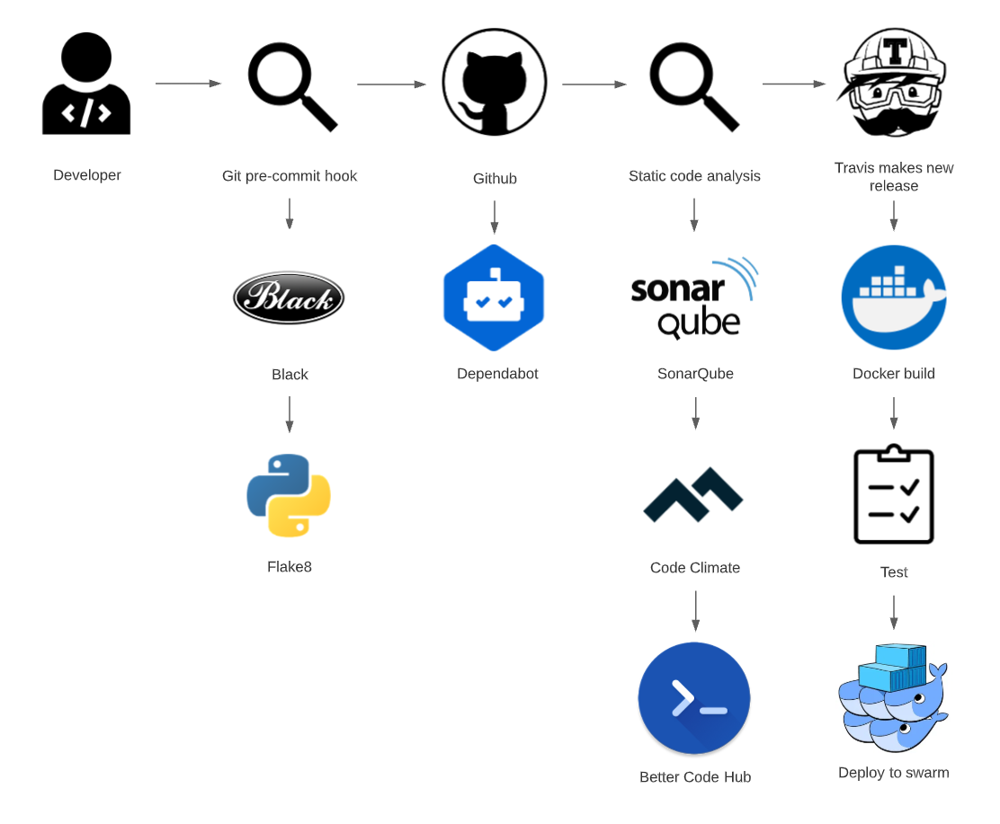
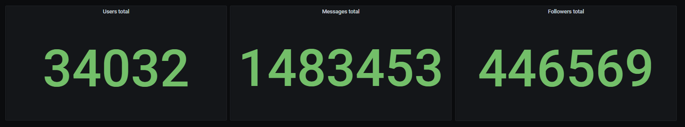
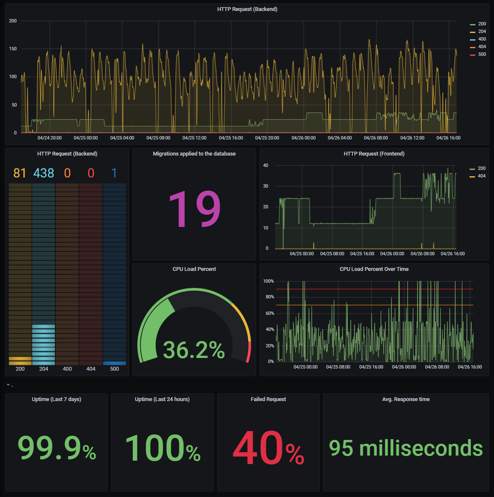

# The Team

The team is organized via Discord. We build a server to support all communication through that.
Here we meet up, discuss meetings, solutions, problems and more. We also created a Github webhook to get a notification on the Discord server whenever there are changes to the project.

We use discord servers to meet up every Monday during and after our lecture. We usually work on the given task most of that day. The work that we did not finish is generally completed at the weekend because of the group members incompatible time schedules during the week.

# CI/CD pipeline

Our CI/CD chain is run everytime we commit to any branch.

{ width=80% }

Before commiting, we have a git hook that runs **Flake8** and **Black** to enforce style consistency across our Python project.

The developer code is then pushed to Github ...

## Static code analysis

We use 3 static analysis tools as software quality gates into your CI/CD pipeline.

We use **SonarQube** for continuous inspection of code quality. It performs automatic reviews with static analysis of the code to detect bugs, code smells, and security vulnerabilities in our project.

We use **Code Climate** for test coverage, 

We use **Better Code Hub** for quality improvements?

## Travis 

Our Travis setup consists of 3 jobs; build, test, deploy.

The first job in our Travis setup is the build job. Before this job, we start with getting access to Travis by using our ssh keys. Afterwards, the build job has three stages; log in to docker, build the three docker images web, API and proxy, and push the three images.

The second job is testing. Here we start by migrating. Migrations are Django’s way of propagating changes we make to our models (adding a field, deleting a model, etc.) into our database schema. We only test the frontend with Travis. When we ran the backend test in Travis, it tried to start up the system.

The third job is deploy, and we only deploy when we commit to the main branch, which is how we make a new release. Before deploying, we set up the git user and tag the commit. The final step is pulling the images and deploying them to the swarm. - deploy token?

# Repository

The repository is currently a mono repository since Django allows us to work with database models tightly incorporated into the framework. 

We split logging into a separate repository because we wanted to be ready for the docker swarm, and we didn't want the logging system to take up all the resources from the web and API.

# Branching strategy

Our branching strategy utilizes the Gitflow Workflow. We will have two main branches and several feature branches:

- Main branch. It is the main branch and contains the production code.
- Developer branch. It is the development branch containing the development code. This code is merged and pushed into main at the end of each completed weekly assignment.
- Feature branches. These branches are used to develop specific features relating to a specific assignment and is merged and pushed into the development branch when it is completed.

Branches should always be branched from the develop branch.

Always pull the newest development branch before creating a feature branch.

Experimenting is preferably done in branches. When working on a specific task, it might make sense to branch out from the feature branch, eg.

{ width=80% }

# Development process

For this project, we worked with an agile development process. Agile is all about moving fast, releasing often, and responding to the needs of your users, even if it goes against what’s in your initial plan. Every week, we plan a new implementation, work on the implementation in smaller bids, test it, and release it for feedback session the following lecture. If we had any bugs or backlog from the last week, we would split up and work on tasks in smaller groups. 

The workflow was distributed because the team would create a set of tasks in the project management tool git provides. Once that was done, the team members would distribute the tasks between each team member. Once a task is completed, a PR had to be made, and once it had gone through a review process, it would get merged into the dev branch. When all tasks for a given week had been completed, a new PR would be made to merge the current stage of the dev branch into the main branch, and a new release would be created with an appropriate dectrion of the recent changes.

Every single team member is responsible for integration and reviews. It is up to the group and the individual team member to decide if they can do the review or integration of a new feature.

# Monitoring

We use the monitoring service Prometheus, to monitor our application...
To display the data that we get from Prometheus, we use the web-based graph interface, Grafana...

We split our monitoring into 2 Grafana dashboards; Business Monitoring (e.g. images/Business Monitoring), which displays our PostgreSQL Query data, and Infrastructure Monitoring (e.g. images/Infrastructure Monitoring), which displays our Prometheus metrics.

The Business Monitoring dashboard contains amount of: Users, Messages and Followers. We used these data to monitor the correctness of successful requests.

{ height=25% }

The Infrastructure Monitoring dashboard contains CPU Load percent, used for up-time calculation as well as strain on the system and HTTP Responses (Frontend / Backend), used to monitor system failure as well as performance in regards to correct response.

# Logging

Logging in Django can be implemented as middleware allowing logging of both current views and future views without tailoring the logging system in every view. It results in a simplistic all-sided logging system without hindering the developer from adding new features or functionality.

Our EFK stack is set up to report each transaction's user, IP address, request type, content, page redirect, and response status. This data is collected by Filebeat when Django invokes its middleware. They are logged as soon as the API/web response is ready to be sent back to the user, and thus both include the initial request and the result of the request. When Filebeat logs the data, it is sent to the Elastic Search database hosted on a separate droplet, such that it is accessible on Kibana.

# Security

The security assessment helped us to identify which issues to prioritize. We performed 2 vulnerability scans overall, and the second scan was done after we had fixed various vulnerabilities that were identified in the first scan.

After using WMAP to scan our system we identified 4 vulnerabilities and noticed that our 2 of most urgent issues were related to our project being unprotected by a firewall.
We also tried to run SQL injections and cross site scripting on our site, which did not reveal any vulnerabilities.

After we created the firewall for our project, we ran a second vulnerability scan using OWASP ZAP. We found just one issue that wasn't picked up by WMAP. 