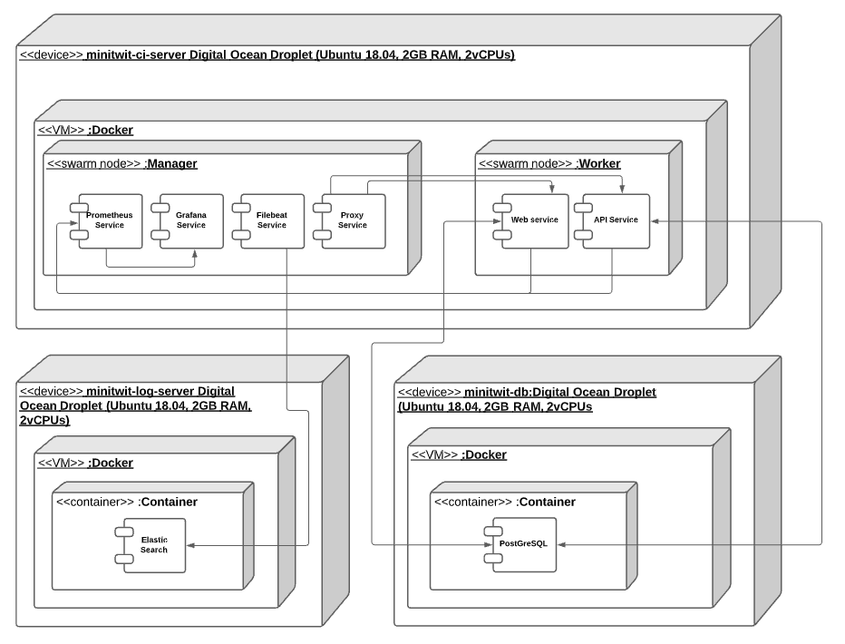
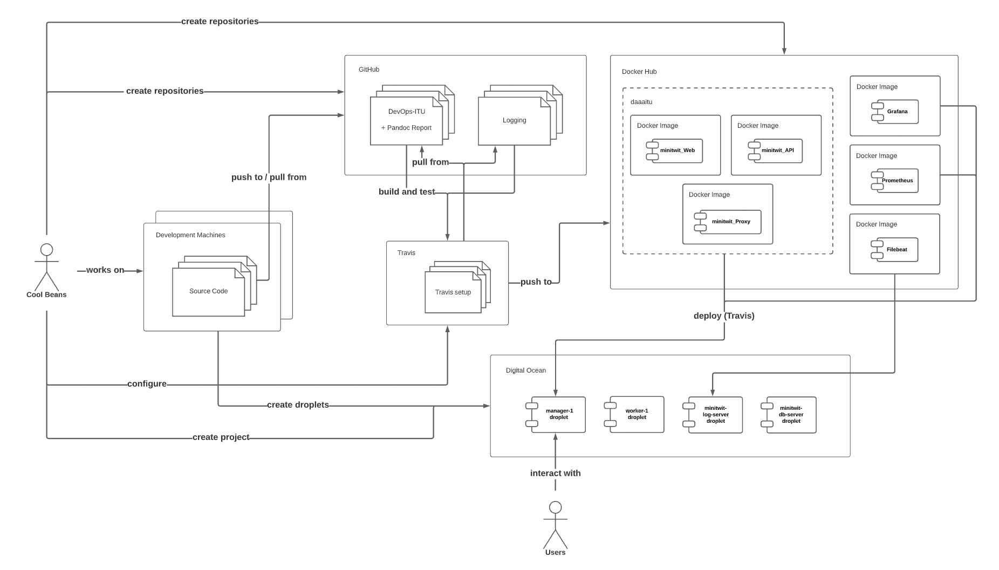

\newpage

# System Design

Minitwit is a social media application that provides basic Twitter-like services. It consists of a web app and API services that are publicly available on the internet. Both services allow the user to register a profile, log in, create messages (tweets), follow and unfollow users. Basic authentication is required when creating messages, following, or unfollowing. Most of the application is written in Python since our web app and API uses the Django framework.

One of the first things that our application needed was a database to store user info and posts. We chose to use a containerized PostgreSQL server.

Minitwit also consists of monitoring tools, which the web app and API communicate with when specific metrics are updated. These tools include Prometheus and Grafana, which allow for the collection and displaying of metrics, respectively. The monitoring tools are handy for us developers since they help us to maintain the system properly.

For logging features, we have implemented an EFK stack that includes Elastic Search, Filebeat, and Kibana. Filebeat is responsible for harvesting the data that we want to log, while Elastic Search is used to store that data in a database. With the logging features implemented, it is much easier for developers to diagnose and debug problems with the system. The logging is absolute and allows perfect reproduction of requests from users to the front-end and backend due to the entire request body and the most significant features of the request header being logged.


# Architecture

Minitwit is hosted on multiple Digital Ocean droplets, which form a Docker Swarm. Our logging and production database are each containerized on their separate Droplets and separated from the swarm to isolated these two systems from the systems exposed to the end-user. It allows us to easily horizontally scale everything besides our persistent data, which should not be horizontally scaled in this scenario. However, if this were supposed to run in a production environment, it would make sense to let Digital Ocean take care of the horizontal scaling of our database instead of maintaining it ourselves and set up a  High Availability and Load Balancing for our db, which includes maintenance of the Master DB and all of the Slaves.

{ width=80% }

With a project that requires a web app, database, and API, it is normal to have the web app communicate with the database through the API. However, Django is designed such that direct communication with a database backend is much simpler to implement than communication with a custom backend server.

For this reason, our web app and API don't communicate with one another, and therefore don't form a frontend/backend structure. Instead, our database is our backend, and our web app/API servers are our frontends.

Django has an integrated Database API allowing both querying, creating, updating and deleting sql entries with connected database instances. Defining the tables within the Django Framework allows Django to both create and manipulate these tables. Additionally it also allows Django to export it's basic tables required for authentication management along side other basic functionalities, instead of storing it in the RAM. It also simplifies the required syntax to both query and add to the tables themselves resulting in much more simple code. However doing it like this where we had to separate the API and the web application introduced some unnecessary complexity where we needed one of the application to take care of database migrations and both of the systems must have the same models for the database to not overwrite the tables in the database.

{ width=50% }


We have a reverse proxy server in front of the web application and the api which routes the incoming traffic from `minitwititu.xyz` and `api.minitwititu.xyz`. The reverse proxy also acts as a loadbalancer where it will redirect a new connection to the module with the least current connections. In this way we can add ass many `worker-(n+1)` nodes to the system and `nginx` will take care of the load-balancing.

Our logging is accomplished by our Filebeat service, along with a logging database that hosts an Elastic Search instance. Filebeat scrapes the swarm manager's output, including all standard output for all services in the stack, and then logs relevant data in the logging database (Elastic Search). Kibana uses this logging database to display our log information in a neat and readable website.

Our monitoring is accomplished by Prometheus, which exposes our metrics on minitwitwitu.xyz/metrics. Our web app and API both make calls to update specific Prometheus metrics, and Prometheus gathers other performance-related metrics from both of them. The /metrics route is also checked by our Grafana service, which hosts a webpage where the metrics can be monitored through customizable dashboards.

As seen in the deployment diagram `prometheus`,`grafana`,`filebeat` and our `reverse proxy/load balancer` are only running on the `manager-node`, and each `node` in the swarm are limited to a single replica of the API and Web. So to upscale the system we need to configure the `Vagrant` file in our repository and increase the amount of `worker-nodes`, increase the amount of replicas in the `remote_files/stack.yml` which will trigger a new deployment through travis if a pull request to main is made. The manual process here is that we need to manually shh to the new worker and connect it to the swarm, this can be done with a simple shell script much like this

```bash
#!/bin/bash
# N is the number of workers.

for ((i = 1; i <= N; ++i)); do 
    vagrant ssh "worker-$(i)" -c "docker swarm join \
    --token $(SWARM_WORKER_TOKEN) \
      $(SWARM_MANAGER_IP):2377"
done


```


# Dependencies

Our dependencies are split into direct dependencies and tools

## Tools

- **Docker** - Cloud computing services
- **Digital Ocean** - Cloud infrastructure provider
- **Travis** - Hosted continuous integration service
- **ElasticSearch** - Distributed RESTful search and analytics engine
- **Kibana** - Data visualization dashboard software for ElasticSearch
- **Filebeat** - File harvester
- **PostGreSQL** - Database Manangement System
- **NGINX** - (Web Server used for reverse proxy)

- **Flake8** - Python style consistency
- **Black** - Python code formatter
- **SonarQube** - Code quality inspector, bugs, vulnerabilities
- **Code Climate** - Test coverage
- **Better Code Hub** - Quality improvements

## Application Dependencies

Web App dependencies are as follows:

- **asgiref 3.3.1** - Includes pytest a framework that makes it easy to write small tests
- **django 3.1.8** - Python Web Framework
- **django-prometheus 2.1.0** - Export django monitoring metrics for Prometheus
- **django-rest-framework 3.12.2** - Web APIs for Django
- **prometheus 0.9.0** - Prometheus instrumentation library
- **psutil 5.8.0** - Python system monitoring
- **psycopg2 2.8.6** - PostgreSQL database adapter for Python
- **pycodestyle 2.7.0** - Python style checker
- **pytz 2021.1** - Cross platform timezone calculations
- **requests 2.25.1** - HTTP library
- **sqlparse 0.4.1** - SQL query parser / transformer
- **uWSGI 2.0.18** - 2.1 - Web service gateway

API dependecies are as follows:

- **asgiref 3.3.1** - Includes pytest a framework that makes it easy to write small tests
- **django 3.1.8** | Python Web Framework
- **django-prometheus 2.1.0** - Export django monitoring metrics for Prometheus 
- **markupsafe 1.1.1** - Safely add untrusted strings to HTML/XML markup
- **psutil 5.8.0** - Python system monitoring
- **psycopg2 2.8.6** - PostgreSQL database adapter for Python
- **pytz 2021.1** - Cross platform timezone calculations
- **requests 2.25.1** - HTTP library
- **sqlparse 0.4.1** - SQL query parser / transformer
- **toml 0.10.2** - Python library for TOML
- **uWSGI 2.0.18 - 2.1** - Web service gateway
- **wrapt 1.12.1** - A Python module for decorators, wrappers and monkey patching.


# Current state

We have some timeout errors, we used nginx to ... This is mainly due to the large size of the `public timeline` and rendering that in the frontend will crash the server, pagination would have solved that however we set a fixed number of messages which would be displayed.

Some error with follower.

For static analysis of the software, we've primarily used SonarCloud. As of now their report on the project is as follows:

 **Reliability**: 0 bugs
 **Security**: 0 vulnerabilities with 3 security hotspots (23 with tests??)
 **Maintainability**: 2 hours technical debt based on 16 code smells, where hereof 8 are critical or major.
 **Duplications**: 5.0 % duplications and 6 dublicated blocks (including tests/settings)
 
 Mono repo caused the settings fields to be duplicated.

The encryption choosen for the user passwords is a weak one, however we could not migrate to a new one since we allready had a lot of users using the wrong encryption methods.

The current state of the logging system is not ideal since the formatting of the logging is all weird and messed ud so we have to make some complicated searchqueries in order to extract usefull log.

# License

We collected all the licenses and copyright notices for every dependency to formulate our product's license. Here, we met the GNU GPL v2 for psycopg2. The GPL series are all copyleft licenses where any derivative work must be distributed under the same or equivalent license terms. Therefore, to cover the product, we chose to go with the GNU General Public License v3.0, which can be found in the licence document. We also collected all copyright notices for the dependencies; these are all placed in the Notice document.

