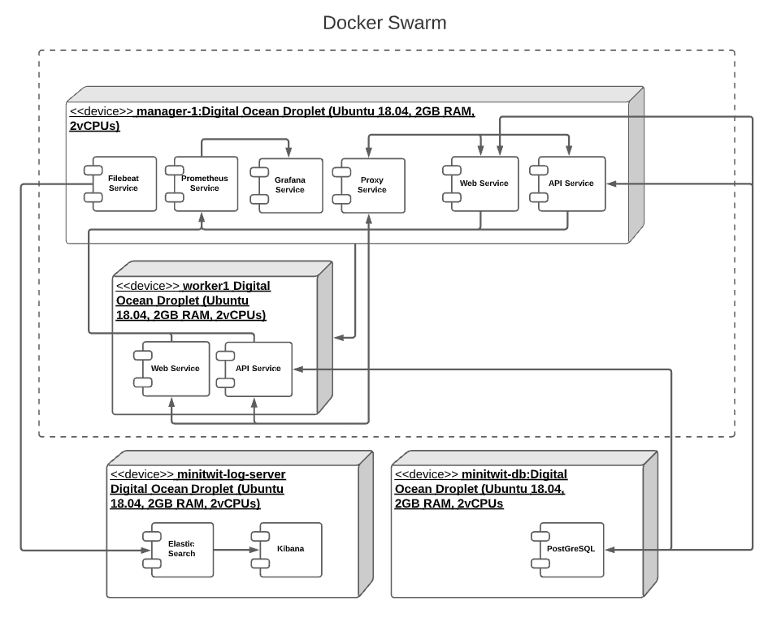

# System Design

Minitwit is a social media application that provides basic Twitter-like services. It consists of a web app and API services that are publicly available on the internet. Both services allow the user to register a profile, log in, create messages (tweets), follow and unfollow users. Basic authentication is required when creating messages, following, or unfollowing. Most of the application is written in Python, since our web app and API are using the Django framework. The web app and API are hosted on separate servers on a single Digital Ocean droplet, and communicate with a server on a separate droplet.

Minitwit also consists of logging and monitoring tools that depends on the web app and API services, which are hosted on multiple servers on the same droplet as the web app and API. The monitoring tools communicate with a logging server which is hosted on a third separate droplet.

# Architecture

The main functionality of Minitwit is contained in the publicly available web and API servers and their database.

*describe what goes on the production CI droplet and why*

Normally, with a project that requires a web app and API, it is normal to have the web app communicate with the database through the API. However, Django designed such that communication with a database backend is much simpler to implement than communication with a custom backend server. For this reason, our web app and API don't communicate with one another, and therefore don't form a frontend/backend structure. Instead, our database is our backend and our web app/API servers are our frontends.

*describe how proxy works w web + API*
We have a nginx proxy that routes traffic from minitwititu.xyz to our web app server's IP address, and from api.minitwititu.xyz to our API server's address. 
*Does the proxy only route HTTP requests? does it route anything else? why is it on the manager node (will it not be scaled)?*

*describe how elastic search and filebeat are structured and why*
*some fuckin sequence diagram or something*
*why is elastic search on a separate droplet? why is filebeat on the manager node? does filebeat communicate w any other services besides elastic search?*

*describe how web + API communicate w prometheus, and how prometheus communicates w grafana*
Our monitoring is accomplished by Prometheus, which exposes our metrics on minitwitwitu.xyz/metrics. Our web app and API both make calls to update certain Prometheus metrics, and Prometheus gathers other performance-related metrics from both of them. Since the web and API services need to work very closely with Prometheus, they are all located on the same Droplet.
The /metrics route is used by our Grafana server, which allows us to create monitoring dashboards for all the metrics on that route. Grafana is hosted on our main CI droplet 

*describe why we chose to put stuff in manager node vs worker node (something about not needing to scale certain services)*

## Deployment

Droplet: device node / server
Docker image: Execution Environment Node
Docker

# Dependencies

Our dependencies are split into ... and tools

## Tools
- Docker 0.0.0 | ...
- Digital Ocean 0.0.0 | ...
- Travis 0.0.0 | ...

## ...??

Web App dependencies are as follows:

- asgiref 3.3.1 - Includes pytest a framework that makes it easy to write small tests
- django 3.1.8 - Python Web Framework
- django-prometheus 2.1.0 - Export django monitoring metrics for Prometheus
- django-rest-framework 3.12.2 - Web APIs for Django
- prometheus 0.9.0 - Prometheus instrumentation library
- psutil 5.8.0 - Python system monitoring
- psycopg2 2.8.6 - PostgreSQL database adapter for Python
- pycodestyle 2.7.0 - Python style checker
- pytz 2021.1 - Cross platform timezone calculations
- requests 2.25.1 - HTTP library
- sqlparse 0.4.1 - SQL query parser / transformer
- uWSGI 2.0.18 - 2.1 - ... (NGINX?)

API dependecies are as follows:

- asgiref 3.3.1 - Includes pytest a framework that makes it easy to write small tests
- django 3.1.8 | Python Web Framework
- django-prometheus 2.1.0 - Export django monitoring metrics for Prometheus 
- markupsafe 1.1.1 - Safely add untrusted strings to HTML/XML markup
- psutil 5.8.0 - Python system monitoring
- psycopg2 2.8.6 - PostgreSQL database adapter for Python
- pytz 2021.1 - Cross platform timezone calculations
- requests 2.25.1 - HTTP library
- sqlparse 0.4.1 - SQL query parser / transformer
- toml 0.10.2 - Python library for TOML
- uWSGI 2.0.18 - 2.1 - ... (NGINX?)
- wrapt 1.12.1 - A Python module for decorators, wrappers and monkey patching.

# Sub systems